# {data-menu-title="Big Picture!"}

::::: {.columns}

:::: {.column width="50%" }

<br>
<br>
<br>
<br>
<br>

[**Big Picture!**]{.center-xy style="font-size:3em;"}


::::


:::: {.column width="50%"}

::: {.fragment}
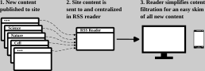
:::

::: {.fragment}
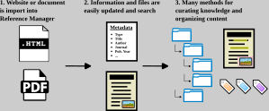
:::

::: {.fragment}
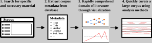
:::

::::

:::::

## A foundation is key to pushing boundaries

### Background

::: {.notes}

The inherently unstructured nature of graduate school is a big hurdle to pushing the boundary of what is know - there is no guide

:::

::: {.columns}

Graduate school

:::: {.column width="75%"}

-   Understand what is known across a domain
-   Identify and explain something that is unknown (Preferably, coherently)
-   Ultimately, unstructured with many possible options

::::

:::: {.column width='25%'}

::::

:::

::: {.absolute right="100" top="10%"}

<div class="simple-sci-know">
  <input type="checkbox" id="circle-toggle">
  <label for="circle-toggle" class="circle">All Scientific Knowledge</label>
  <div class="red-circle"></div>
</div>

:::

::: {.absolute left="0" bottom="0"}

<div class="wavy-sci-know">
  <input type="checkbox" id="toggle-circle" />
  <label for="toggle-circle" class="wavy-circle">All Scientific Knowledge</label>
  <div class="red-circle"></div>
</div>

:::

## [Improve personal professional care with systematic approaches]{.small}

### Background

::: {.columns}

:::: {.column}

::::: {.r-stack}

:::::: {.fragment}

Feelings of:

::::::: {.nonincremental .smaller}

- guilt
- all-consuming prioritization
- wealth disparity
- depression
- anxiety
- stupidity
- uncertainty and disconnection (I.e. Lost)
- urgency and pressure (I.e. time slipping away
- regret
- stress
- isolation

:::::::

::::::

::::::: {.fragment .remove-on-next}

Solutions?

- [grin and bear it](https://smea.uw.edu/currents/managing-graduate-school-with-depression/){target="_blank"}
- too general to fully address the scope

:::::::

:::::

::::

:::: {.column}

{.smaller}](./fig/graduate-school-mental-health.png){.lightbox}

::::

:::


# Centralizing Literature


## RSS is a web-based aggregation tool

### Background

::: {.columns}

:::: {.column width="50%"}
- What does RSS stand for?
    
    - Conflicting accounts!
      - **[R]{.underline}**eally **[S]{.underline}**imple **[S]{.underline}**yndication
      - **[R]{.underline}**ich **[S]{.underline}**ite **[S]{.underline}**ummary
      - **[R]{.underline}**DF **[S]{.underline}**ite **[S]{.underline}**ummary
    - RSS $\equiv$ a website feed aggregator
::::

:::: {.column width="50%"}
- What ***is*** RSS though?
    
    - Set of technical standards
      - A standard, computer-readable format
    - Written in extensible mark-up language (XML)
    - For storing and sending data through the internet
::::

:::

[**An updating scientific journal website aggregation system!**]{.fragment}


## [An RSS aggregator will centralize all feeds across devices]{style="font-size:0.70em;"}

### Background

The day an important article is published you will be able to find it!

- Single concentrated reference point
  - Track **many** different websites
  - Regular updates (~1-6hrs)
  - Convenient 
    - Desktop
    - Mobile
    - Tablet
    - Browser

## [Too many software options!!!]{style="font-size:0.80em;"}

### Background

::: {.notes}

The goal is not to become a poweruser!!!

This serves a focused purpose and it does that well.

:::

[There are dozens of notable RSS readers.](https://play.google.com/store/search?q=rss+feed+app){target="_blank"}

[Most have a pay-tiered system.]{.fragment}

- I suggest Inoreader... currently
  
  - Most useful options at unpaid subscription level are:
    - Compatible with IOS, Andriod, and the Web
    - Organizing with folders and tags 
    - Highlighting keywords 
    - Ability to search

# Install and Set Up

::: {.nonincremental}
- Install Inoreader
- Find academic journal feeds
- Organize feeds
:::

## Create an account {data-menu-title="Create an account: Step 1"}

### Install and Set Up

::: {.columns}

:::: {.column}

::::: {.nonincremental}

1.  Go to [Inoreader](https://www.inoreader.com/){target="_blank"}

:::::

::::

:::: {.column}

[{.lightbox}]{.absolute top="400" left="200" width="500"}

::::

:::

## Create an account {data-menu-title="Create an account: Step 2"}

### Install and Set Up

::: {.columns}

:::: {.column}

::::: {.nonincremental}

1.  [Go to [Inoreader](https://www.inoreader.com/)]{.op}
2.  Select `Create account`

:::::

::::

:::: {.column}

[{.lightbox}]{.absolute top="400" left="200" width="500"}

::::

:::

## Create an account {data-menu-title="Create an account: Step 3"}

### Install and Set Up

::: {.columns}

:::: {column}

::::: {.nonincremental}

1.  [Go to [Inoreader](https://www.inoreader.com/)]{.op}
2.  [Select `Create account`]{.op}
3.  Fill in email and password
4.  Select `Create account`

:::::

::::

:::: {.column}

[{.lightbox}]{.absolute top="400" left="200" width="500"}

::::

:::

## Optionally, download the mobile app

### Install and Set Up

::: {.notes}

for local image as badges

:::

- Benefits
  - Portability
  - Interoperability
  - Make doom scrolling productive

[Click your system below:]{.fragment}

```{=html}
<style>
.badge-container {
    display: flex;
    flex-wrap: wrap;
    gap: 16px;
    justify-content: center;
    align-items: center;
}

.badge-container .badge {
    flex: 1;
    max-width: 200px;
    text-align: center;
}

.badge-container .badge img {
    height: 100px;
    width: auto;
    border-radius: 8px;
    transition: transform 0.2s ease;
}

.badge-container .badge img:hover {
    transform: scale(1.25);
}
</style>

<div class="badge-container">

  <div class="badge">
    <a href="https://play.google.com/store/apps/details?id=com.innologica.inoreader&pcampaignid=web_share" target="_blank">
      
    </a>
  </div>
  
  <div class="badge">
    <a href="https://apps.apple.com/us/app/inoreader-news-rss-reader/id892355414" target="_blank">
      
    </a>
  </div>

</div>
```

## Optionally, install a browser extension

### Install and Set Up

::: {.nonincremental}

- Benefits
  - Portability
  - Interoperability
  - Make doom scrolling productive

:::

Click your system below:


```{=html}
<div class="badge-container">
    <div class="badge">
        <a href="https://chrome.google.com/webstore/detail/rss-reader-extension-by-i/kfimphpokifbjgmjflanmfeppcjimgah" target="_blank">
            
        </a>
    </div>
    <div class="badge">
        <a href="https://addons.mozilla.org/en-US/firefox/addon/rss-reader-extension-inoreader/" target="_blank">
            
        </a>
    </div>
    <div class="badge">
        <a href="https://microsoftedge.microsoft.com/addons/detail/rss-reader-extension-by-/lbjfhdjlblncekgomhadnnpampcahhal" target="_blank">
            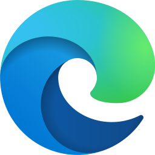
        </a>
    </div>
</div>
```


## Quick guide to curate feeds in Inoreader {data-menu-title="Curate feeds: Step 1"}

### Install and Set Up

::: {.columns}

::: {.column width="45%"}

:::: {.nonincremental}

1.  Select `Add new`

::::

:::

::: {.column width="55%"}
[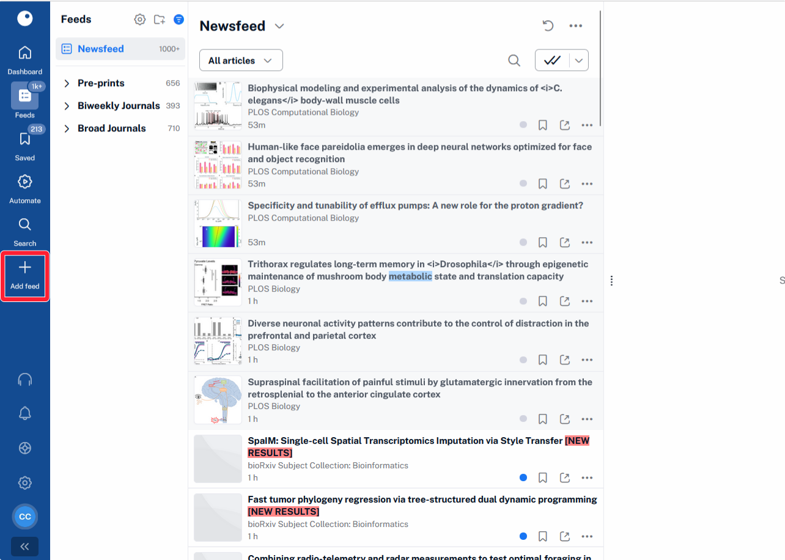{.lightbox}]{.absolute top="125" left="475" width="700"}
:::
:::

## Quick guide to curate feeds in Inoreader {data-menu-title="Curate feeds: Step 2"}

### Install and Set Up

::: columns
::: {.column width="45%"}
::: nonincremental
1.  [Select `Add new`]{.op}
2.  Search a topic, website, or journal
:::
:::

::: {.column width="55%"}
[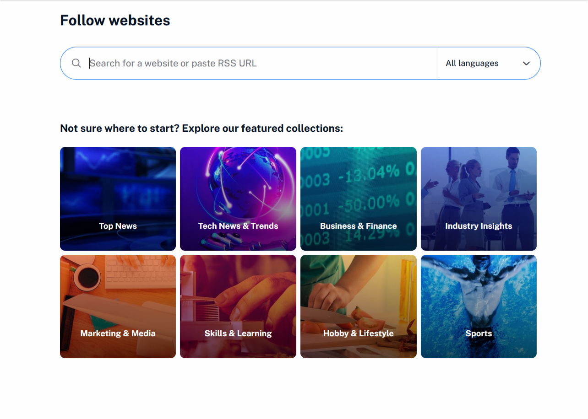{.lightbox}]{.absolute top="125" left="475" width="700"}
:::
:::

## Quick guide to curate feeds in Inoreader {data-menu-title="Curate feeds: Step 3"}

### Install and Set Up

::: columns
::: {.column width="45%"}
::: nonincremental
1.  [Select `Add new`]{.op}
2.  [Search a topic, website, or journal]{.op}
3.  Select `Follow` from the feed suggestions
:::
:::

::: {.column width="55%"}
[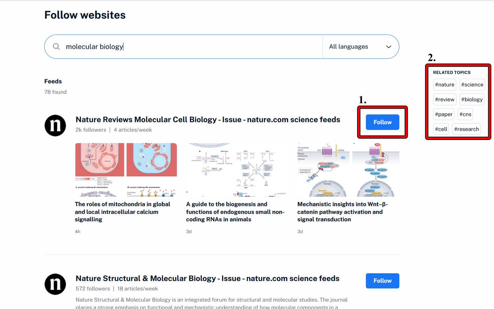{.lightbox}]{.absolute top="125" left="475" width="700"}
:::
:::

## Gather feeds to fit your research interests {#Gather_Feeds}

### Install and Set Up

::: notes

go to science.com and scroll to the bottom

click the rss symbol

copy url of rss xml site and paste into inoreader

wsj:thejournal (rss symbol)

Use nature (rss feed), science (rss symbol), and biorxiv (specific set up) as examples

:::

```{ojs}
//| echo: false
//| output: false
document.getElementById("userInput").addEventListener("input", function() {
  let userInput = this.value;
  let words = userInput.split("-");
  
  let output = "";
  words.forEach(word => {
    output += `<li>${word}</li>`;
  });
  
  document.getElementById("outputText").innerHTML = `<ul>${output}</ul>`;
});
```

::: {.columns}

:::: {.column width="60%"}

-   Journal options {width=15}

    -   [Wiki of Academic Journals](https://en.wikipedia.org/wiki/List_of_acadaemic_journals){target="_blank"}
    -   [Wiki of Scientific Journals](https://en.wikipedia.org/wiki/List_of_scientific_journals){target="_blank"}
    -   [Scopus Journals](https://www.scopus.com/sources){target="_blank"}
    -   [The NIH Library of Journals](https://onesearch.nihlibrary.ors.nih.gov/discovery/jsearch?vid=01NIH_INST%3ANIH&lang=en){target="_blank"}
    -   [ChatGPT](https://chatgpt.com): "what are the best journals for [bioinformatics] research?"
    - [Find RSS Links on a Website Supp.](#Finding_RSS_Links)
    
::::

:::: {.column width="40%"}

::::: interactive-textbox
<input type="text" id="userInput" placeholder="Type some ideas...">

<p id="outputText">

</p>
:::::
::::
:::

## Organize feeds by creating folders {data-menu-title="Organize with new folders: Step 1"}

### Install and Set Up

Create new folder

::: columns
::: {.column width="45%"}
::: nonincremental
1.  Select :file_folder: icon
:::
:::

::: {.column width="65%"}
[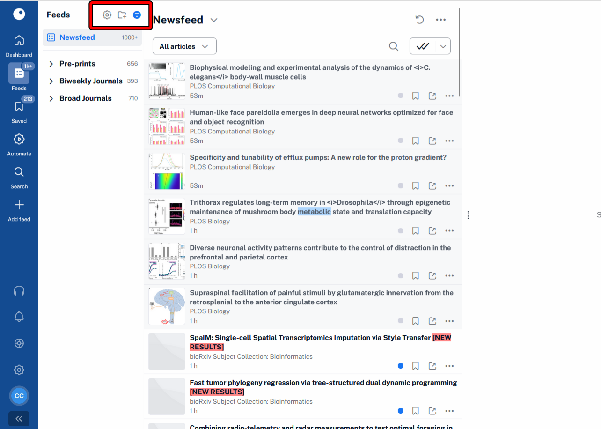{.lightbox}]{.absolute top="125" left="475" width="700"}
:::
:::

## Organize feeds by creating folders {data-menu-title="Organize with new folders: Step 2"}

### Install and Set Up

Create new folder

::: columns
::: {.column width="45%"}
::: nonincremental
1.  [Select :file_folder: icon]{.op}
2.  Write `Folder name`
:::
:::

::: {.column width="65%"}
[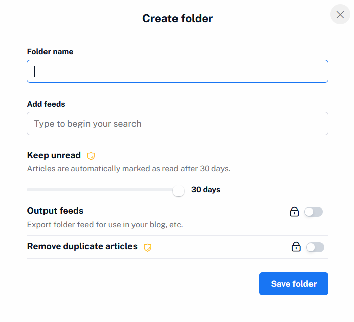{.lightbox}]{.absolute top="125" left="575" width="500"}
:::
:::

## Organize feeds by creating folders {data-menu-title="Organize with new folders: Step 3"}

### Install and Set Up

Create new folder

::: columns
::: {.column width="45%"}
::: nonincremental
1.  [Select :file_folder: icon]{.op}
2.  [Write `Folder name`]{.op}
3.  Begin searching for feeds
:::
:::

::: {.column width="65%"}
[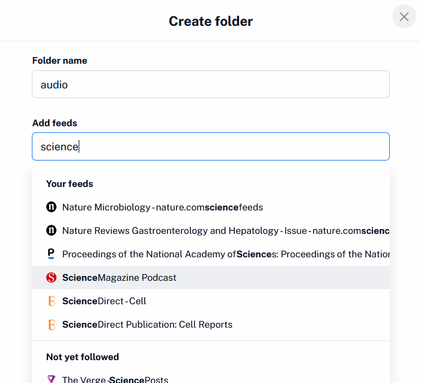{.lightbox}]{.absolute top="125" left="575" width="500"}
:::
:::

## Organize feeds by creating folders {data-menu-title="Organize with new folders: Step 4"}

### Install and Set Up

Create new folder

::: columns
::: {.column width="45%"}
::: nonincremental
1.  [Select :file_folder: icon]{.op}
2.  [Write `Folder name`]{.op}
3.  [Begin searching for feeds]{.op}
4.  Select feeds to add
:::
:::

::: {.column width="65%"}
[{.lightbox}]{.absolute top="125" left="575" width="500"}
:::
:::

## [Organize feeds by adding to existing folders]{style="font-size:0.8em;"} {data-menu-title="Adding to existing folders: Step 1"}


### Install and Set Up

Add to existing

::: columns
::: {.column width="45%"}
::: nonincremental
1.  Select :gear: icon
:::
:::

::: {.column width="65%"}
[{.lightbox}]{.absolute top="100" left="475" width="700"}
:::
:::

## [Organize feeds by adding to existing folders]{style="font-size:0.8em;"} {data-menu-title="Adding to existing folders: Step 2"}

### Install and Set Up

Add to existing

::: columns
::: {.column width="45%"}
::: nonincremental
1.  [Select :gear: icon]{.op}
2.  Select folders dropdown
:::
:::

::: {.column width="65%"}
[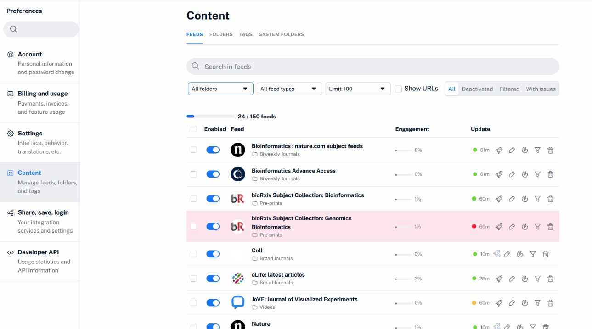{.lightbox}]{.absolute top="200" left="475" width="700"}
:::
:::

## [Organize feeds by adding to existing folders]{style="font-size:0.8em;"} {data-menu-title="Adding to existing folders: Step 3"}

### Install and Set Up

Add to existing

::: columns
::: {.column width="45%"}
::: nonincremental
1.  [Select :gear:]{.op}
2.  [Select folders dropdown]{.op}
3.  Select `Without folder`
:::
:::

::: {.column width="65%"}
[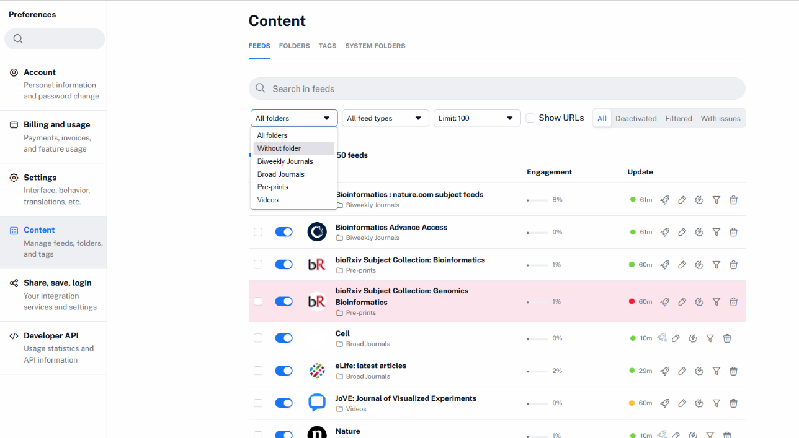{.lightbox}]{.absolute top="200" left="475" width="700"}
:::
:::

## [Organize feeds by adding to existing folders]{style="font-size:0.8em;"} {data-menu-title="Adding to existing folders: Step 4"}

### Install and Set Up

Add to existing

::: columns
::: {.column width="45%"}
::: nonincremental
1.  [Select :gear:]{.op}
2.  [Select folders dropdown]{.op}
3.  [Select `Without folder`]{.op}
4.  Select feeds
:::
:::

::: {.column width="65%"}
[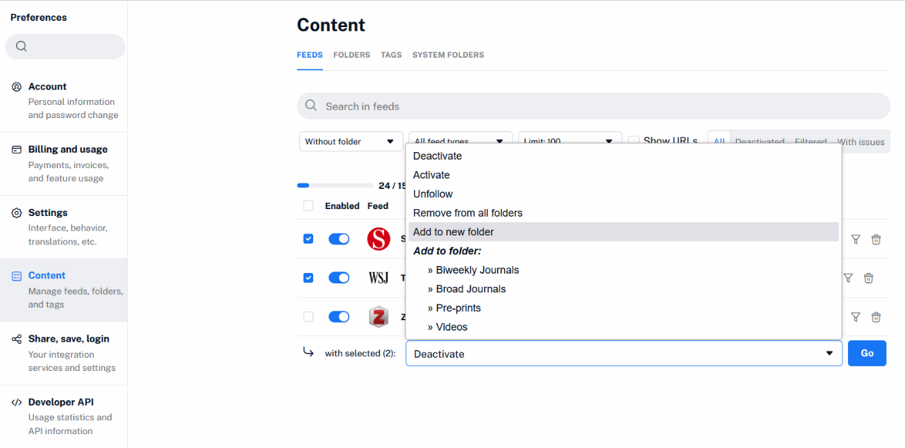{.lightbox}]{.absolute top="200" left="475" width="700"}
:::
:::

## [Organize feeds by adding to existing folders]{style="font-size:0.8em;"} {data-menu-title="Adding to existing folders: Step 5"}

### Install and Set Up

Add to existing

::: columns
::: {.column width="45%"}
::: nonincremental
1.  [Select :gear:]{.op}
2.  [Select folders dropdown]{.op}
3.  [Select `Without folder`]{.op}
4.  [Select feeds]{.op}
5.  Select option from dropdown
:::
:::

::: {.column width="65%"}
[{.lightbox}]{.absolute top="200" left="475" width="700"}
:::
:::

## Make your folders for your feeds

### Install and Set Up

::: columns
::: {.column width="75%"}
-   Consider grouping journals categories:

    -   Broad 
        - interdisciplinary, high-impact factor
    -   Topics 
        - Molecular Biology, Genetics, Bioinformatics 
    -   Time span they publish or you want to check
        - Continuous, Weekly, Monthly, Quarterly, Annually
        - ["Nature is a weekly international journal"](https://www.nature.com/nature/journal-information){target="_blank"}
    -   Access
        - Open access, Publisher, Preprints
:::

::: {.column width="25%"}
::: interactive-textbox
<input type="text" id="userInput2" placeholder="Type some ideas...">

<p id="outputText2">

</p>
:::
:::
:::

```{ojs}
//| echo: false
//| output: false
document.getElementById("userInput2").addEventListener("input", function() {
  let userInput2 = this.value;
  let words = userInput2.split("-");
  
  let output = "";
  words.forEach(word => {
    output += `<li>${word}</li>`;
  });
  
  document.getElementById("outputText2").innerHTML = `<ul>${output}</ul>`;
});
```

# Suggested Usage

::: {.nonincremental}
- The functionality of Inoreader
  - Highlighting keywords
  - Tagging system
  - Rapid navigation
  - Search the feeds
:::

## [Highlighting keywords for efficient literature discovery]{style="font-size:0.80em;"}

### Suggested Usage

::: columns
::: {.column width="30%"}

[Assign color to keywords]{.smaller}

-   [**Trouble? Try GenAI for a list:**]{.smaller}
    -   [What are keywords for \[microbial metagenomic metabolomic metabolite cancer\] research?]{.smaller}
    -   [Please expand this list further. (Generic or with direction...)]{.smaller}

:::

::: {.column width="70%"}
```{=html}
<iframe id="iframe1" width="780" height="500" src="./fig/highlighters.html" title="Inoreader highlighter"
    style="display: block; margin: 0 auto; position: relative; top: 50px; left: 0; right: 0;">
</iframe>
```
:::
:::

## Tags articles to organize and recall

### Suggested Usage


::: notes
-   Like the `Read later` category
:::

`Library`

-   Tag with keywords like:
    -   Topics: ProjectName, QE, Grant
    -   Content: Video, peer, opinion, review
    -   Resources: Github, scripts, references
    -   Priority: High, medium, low

## [Navigating literature blazingly fast with keybindings]{style="font-size:0.80em;"}

### Suggested Usage

::: columns

::: {.column width="20%"}
`h` or `?` for keybindings
:::

::: {.column width="80%"}
```{=html}
<iframe id="iframe2" width="780" height="500" src="./fig/hotkeys.html" title="Inoreader highlighter"
    style="display: block; margin: 0 auto; position: relative; top: 50px; left: 0; right: 0;">
</iframe>
```
:::

:::

## [Navigating literature blazingly fast with keybindings]{style="font-size:0.80em;"}

### Suggested Usage


::: columns
::: {.column width="75%"}
Below are some suggestions to speed-up your usage:

-   `n`, `p` or with `shift`: navigate the articles or side-bar
-   `j`, `k` : navigate the Article view or `space`: to scroll through the abstract
-   `m`, `f`: mark the articles as read or read later
-   `1`, `3`: change views from list to cards
-   use `v` to load a new tab or `w` to load the content
:::

::: {.column width="25%"}
::: interactive-textbox
<input type="text" id="userInput3" placeholder="Type some ideas...">

<p id="outputText3">

</p>
:::
:::
:::

```{ojs}
//| echo: false
//| output: false
document.getElementById("userInput3").addEventListener("input", function() {
  let userInput3 = this.value;
  let words = userInput3.split(" ");
  
  let output = "";
  words.forEach(word => {
    output += `<li>${word}</li>`;
  });
  
  document.getElementById("outputText3").innerHTML = `<ul>${output}</ul>`;
});
```

## Search the feeds for rapid re/discovery

### Suggested Usage

::: columns
::: {.column width="50%"}
Located at:

-   Upper right [`r knitr::asis_output("\U1F896")`]{.arrow} :mag:
-   Left-hand [`r knitr::asis_output("\U1F896")`]{.arrow} :mag:
-   `Add feed` [`r knitr::asis_output("\U1F896")`]{.arrow} `Monitor feed`
:::

::: {.column width="50%"}
Straight-forward operation:

-   Search articles in feeds, folder, or tags

:::: {.fragment}

::::: {.nonincremental}

-   Use boolean operators
    -   `AND`
    -   `OR`
    -   `NOT`
    -   `""`
    -   `()`

:::::

::::    

:::
:::

::: notes
Boolean operators are terms used to combine or exclude keywords in search queries to narrow down or broaden search results in a search engine. They are words like "AND," "OR," and "NOT" that help refine the search by specifying relationships between keywords.

```         
AND: Narrows down the search by requiring both terms to be present in the results. For example, searching for "cats AND dogs" will return results that mention both cats and dogs.

OR: Broadens the search, returning results that include either one or both of the specified terms. Searching for "cats OR dogs" will retrieve results mentioning either cats or dogs or both.

NOT: Excludes specific terms from the search results. For instance, searching for "cats NOT dogs" will display results related to cats but exclude any that mention dogs.
```

These operators are useful for making searches more precise and tailored to your needs by including, excluding, or combining keywords in various ways.
:::


# Break!

```{r}
#| echo: false
countdown::countdown(minutes = 5, seconds = 0, warn_when = 120, 
                     right = "0%", top = "10%",
                     blink_colon = TRUE, id = "special_timer")
```

# Managing Literature


## [Reference Management Software Lead to Thriving Scholars]{.small}

### Background

::: {layout="[[100], [50, 50]]"}
-   What *is* RMS?
    -   Database of bibliographic records
    -   Creator of bibliographic citations
    -   Document and knowledge management
        -   Collection structure
        -   Tags
        -   Notetaking

[What influences choice?]{.fragment}

::: small
-   Campus educators (library, dept, etc.)
-   Teachers and Colleagues
-   But, Overall? Exposure!
:::
:::

## [Scholars Want the Easiest Tool for Reference Management]{.small}

### Background

::: {layout="[[70,30], [100]]"}
![[User-defined important parameters for RMS. Nitsos et al., 2022, p. 105]{.small}](./fig/ref-manager-participate-ratings2.png){fig-align="left"}

#### Scholar needs?

1.  Easy
2.  Free
3.  Friendly
:::

## [Zotero is ***Free***, Open-source, ***Community-driven*** Software]{.small}

### Background

![[Participant's ratings of RMS. Cai et al., 2021, p. 68]{.small}](./fig/ref-manager-participate-ratings.png)

::: fragment
> Zotero \[zoh-TAIR-oh\] is a free, easy-to-use tool to help you collect, organize, cite, and share your research sources. - [Zotero's quick start guide](https://www.zotero.org/support/quick_start_guide){target="_blank"}
:::

# Install & Setup

::: nonincremental
-   Download Zotero
-   Optimize Zotero Storage
-   Extend Zotero for Knowledge Management
:::

## Benefits of a web account {data-menu-title="Web account benefits: Storage"}

### Install & Setup

::: {.columns}

:::: {.column}

#### Benefits

-   [Free 300 mb storage]{.hovertext data-hover="May store only metadata or use WebDav options as well" style="--hover-width: 250px;"}

::::

:::: {.column}

[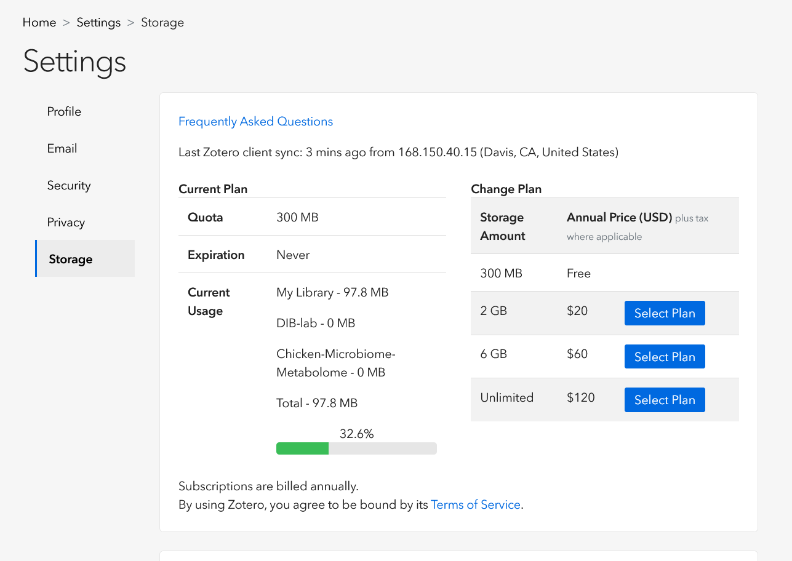{.lightbox}]{fig-align="right"}

::::

:::

## Benefits of a web account {data-menu-title="Web account benefits: interoperability"}

### Install & Setup

::: {.columns}

:::: {.column}

#### Benefits

::::: {.nonincremental}

-   [Free 300 mb storage]{.hovertext data-hover="May store only metadata or use WebDav options as well" style="--hover-width: 250px;"}

:::::

-   Access library anywhere with internet
-   Syncing and backup across all devices
-   Join shared collections with [Zotero groups](https://www.zotero.org/groups){target='_blank'}

::::

:::: {.column}

[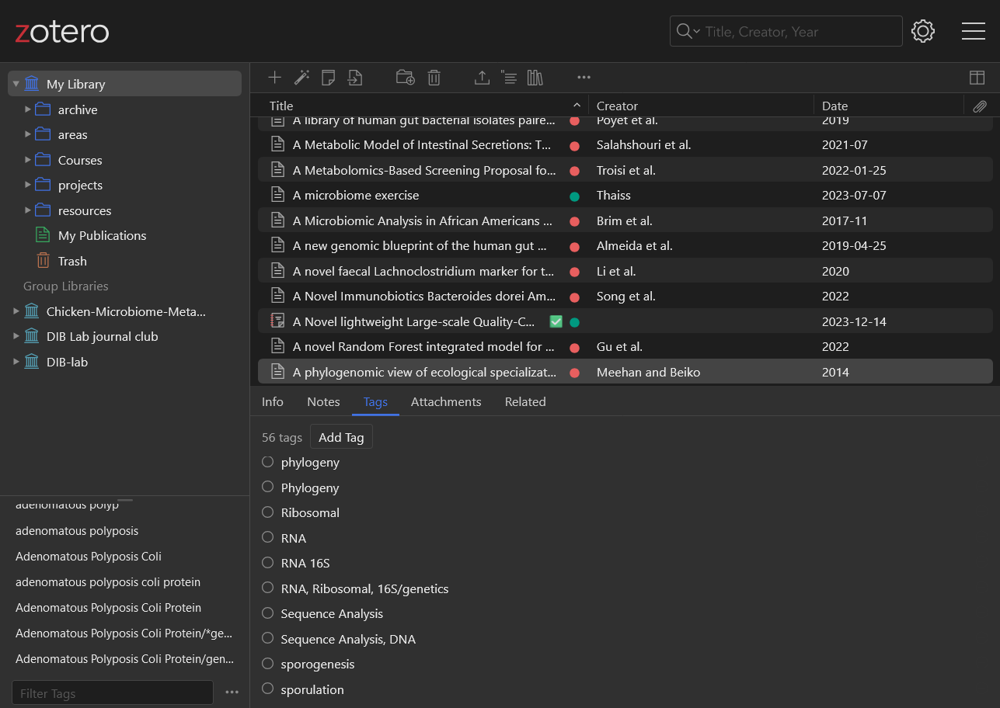{.lightbox}]{fig-align="right"}

::::

:::

## Create a web account {data-menu-title="Web account creation: Step 1"}

### Install & Setup

::: {.columns}

:::: {.column}

1. Go to [zotero.org](https://www.zotero.org/)

::::

:::: {.column}

[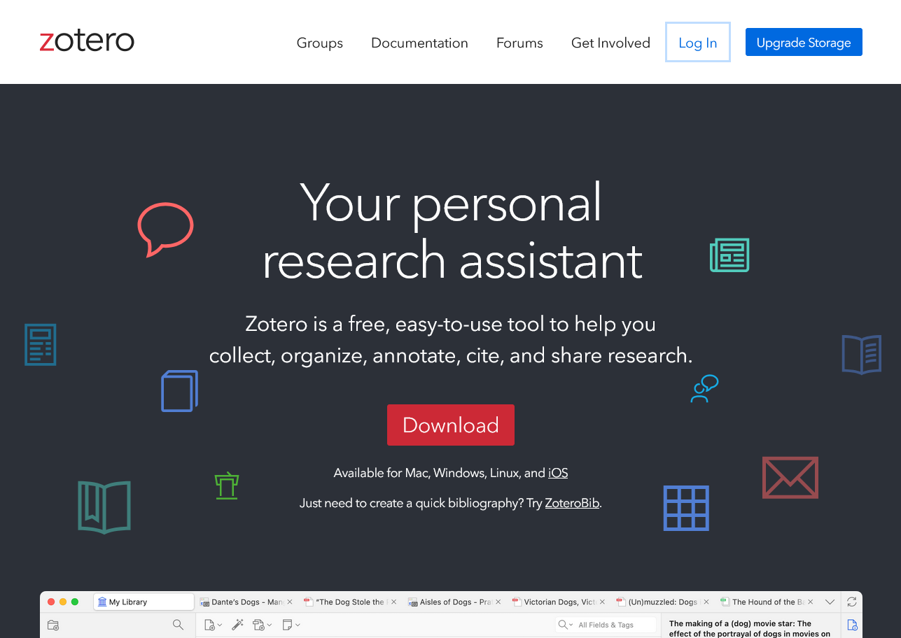{.lightbox}]{fig-align="right"}

::::

:::

## Create a web account {data-menu-title="Web account creation: Step 2"}

### Install & Setup

::: {.columns}

:::: {.column}

::::: {.nonincremental}

1. [Go to [zotero.org](https://www.zotero.org/)]{.op}
2. Click `Log In`

:::::

::::

:::: {.column}

[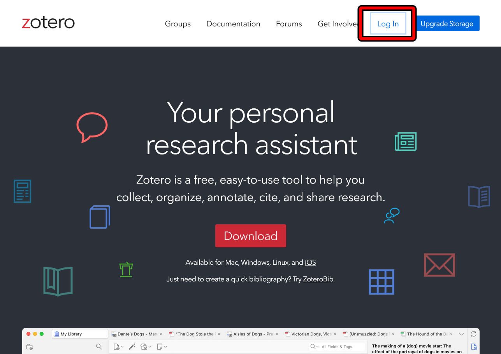{.lightbox}]{fig-align="right"}

::::

:::

## Create a web account {data-menu-title="Web account creation: Step 3"}

### Install & Setup

::: {.columns}

:::: {.column}

::::: {.nonincremental}

1. [Go to [zotero.org](https://www.zotero.org/)]{.op}
2. [Click `Log In`]{.op}
3. Click `Register for a free account`

:::::

::::

:::: {.column}

[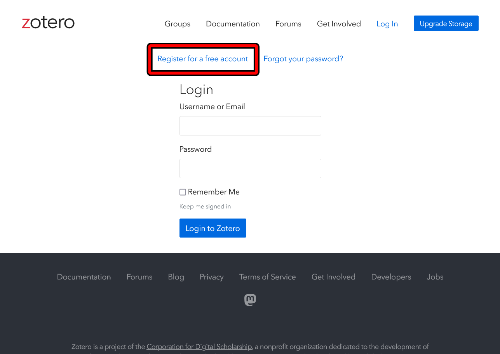{.lightbox}]{fig-align="right"}

::::

:::

## Create a web account {data-menu-title="Web account creation: Step 4"}

### Install & Setup

::: {.columns}

:::: {.column}

::::: {.nonincremental}

1. [Go to [zotero.org](https://www.zotero.org/)]{.op}
2. [Click `Log In`]{.op}
3. [Click `Register for a free account`]{.op}
4. Fill out the info

:::::

::::

:::: {.column}

[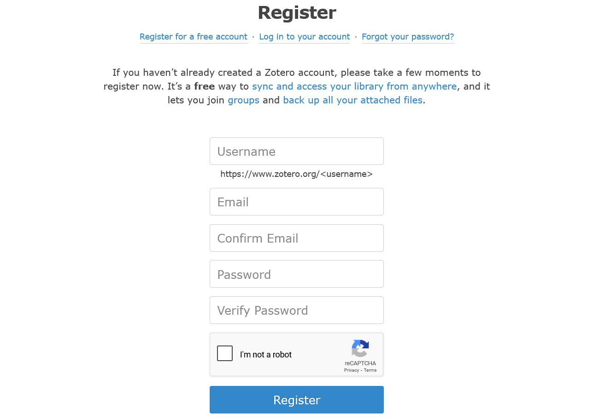{.lightbox}]{fig-align="right"}

::::

:::

## Create a web account {data-menu-title="Web account creation: Step 5"}

### Install & Setup

::: {.columns}

:::: {.column}

::::: {.nonincremental}

1. [Go to [zotero.org](https://www.zotero.org/)]{.op}
2. [Click `Log In`]{.op}
3. [Click `Register for a free account`]{.op}
4. [Fill out the info]{.op}
5. Click `Register`

:::::

::::

:::: {.column}

[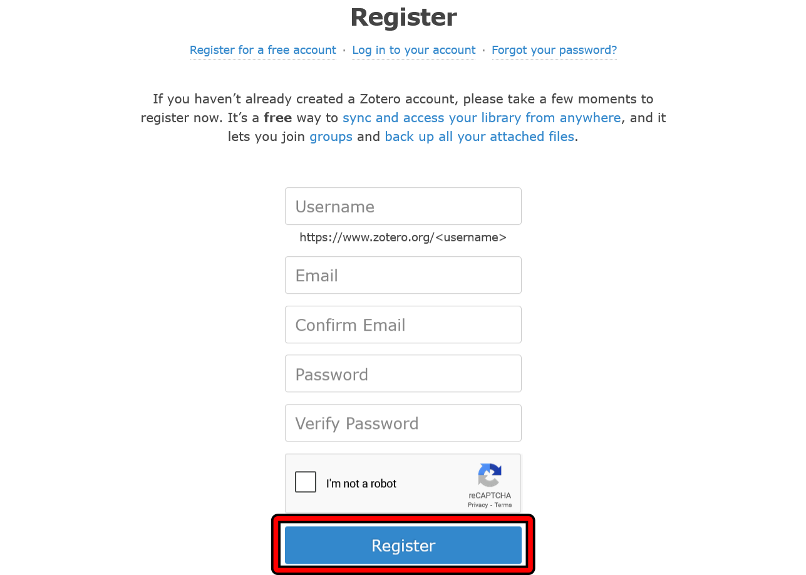{.lightbox}]{fig-align="right"}

::::

:::

## Download Zotero for your Operating System

### Install & Setup

At [zotero.org/download](https://www.zotero.org/download/)

::: {.columns}

:::: {.column width="40%"}

#### Details

::::: {.fragment}

:::::: {.nonincremental}

-   Mac
-   Windows
-   Linux
-   [Chromebook](https://www.zotero.org/support/kb/installing_on_a_chromebook)
-   [Automatically updates]{.hovertext data-hover="May manually install over existing version without data loss" style="--hover-width: 250px;"}

::::::

:::::

::::

:::: {.column width="60%"}

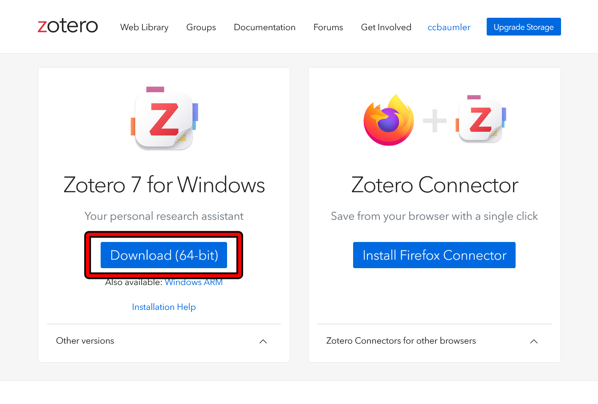{.lightbox}

::::

:::

## [Zotero Connector in browser simplifies storing articles]{.small}

### Install & Setup

::: notes
https://forums.zotero.org/discussion/76073/solved-zotero-connector-shortcut-conflict-with-firefox
:::

At [zotero.org/download](https://www.zotero.org/download/)

::: {.columns}

:::: {.column width="40%"}

#### Details

::::: {.fragment}

:::::: {.nonincremental}

-   Firefox (Recommended)
-   Chrome
-   Edge
-   Safari

::::::

:::::

::::

:::: {.column width="60%"}

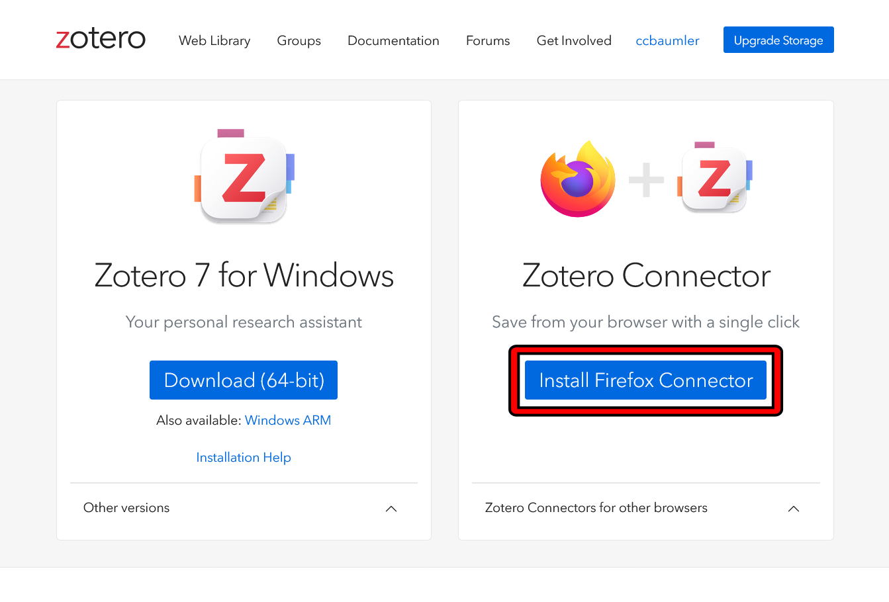{.lightbox}

::::

:::

## Optionally, download the app

### Install & Setup

- Benefits
  - Portability
  - interoperability
  - Gathering and managing on the go
    -   `Share` [`r knitr::asis_output("\U1F896")`]{.arrow} `Zotero app`
    
[Click your operating system below:]{.fragment}

```{=html}
<style>
.badge-container {
    display: flex;
    flex-wrap: wrap;
    gap: 16px;
    justify-content: center;
    align-items: center;
}

.badge-container .badge {
    flex: 1;
    max-width: 200px;
    text-align: center;
}

.badge-container .badge img {
    height: 100px;
    width: auto;
    border-radius: 8px;
    transition: transform 0.2s ease;
}

.badge-container .badge img:hover {
    transform: scale(1.25);
}
</style>

<div class="badge-container">

  <div class="badge">
<a href="https://play.google.com/store/apps/details?id=org.zotero.android" target="_blank">
      
    </a>
  </div>
  
  <div class="badge">
    <a href="https://apps.apple.com/us/app/zotero/id1513554812" target="_blank">
      
    </a>
  </div>

</div>
```

## [Downloading plugins to extend Zotero's abilities!]{.small}

### Install & Setup

-   Download the `.xpi` file for the version you want
    -   For Firefox, right-click and `Save Link As...`
        -   OR! Set the `Boolean` for `browser.altClickSave` to true at `about:config`

::: {.nonincremental}
:::: {.columns}
::::: {.column width="50%"}

::::: {.fragment}
:::::: {.nonincremental}

-   [Actions and Tags](https://github.com/windingwind/zotero-actions-tags#actions-and-tags-for-zotero){target="_blank"}
    -   [Latest Release](https://github.com/windingwind/zotero-actions-tags/releases/latest){target="_blank"}
-   [Actions and Tags](https://github.com/windingwind/zotero-actions-tags#actions-and-tags-for-zotero){target="_blank"}
    -   [Latest Release](https://github.com/windingwind/zotero-actions-tags/releases/latest){target="_blank"}
-   [Actions and Tags](https://github.com/windingwind/zotero-actions-tags#actions-and-tags-for-zotero){target="_blank"}
    -   [Latest Release](https://github.com/windingwind/zotero-actions-tags/releases/latest){target="_blank"}
::::::
:::::

:::::

::::: {.column width="50%"}

:::::{.fragment}
:::::: {.incremental}

-   [ZotMoov](https://github.com/wileyyugioh/zotmoov#zotmoov){target="_blank"}
    -   [Latest Release](https://github.com/wileyyugioh/zotmoov/releases/latest){target="_blank"}
-   [Actions and Tags](https://github.com/windingwind/zotero-actions-tags#actions-and-tags-for-zotero){target="_blank"}
    -   [Latest Release](https://github.com/windingwind/zotero-actions-tags/releases/latest){target="_blank"}
-   [Actions and Tags](https://github.com/windingwind/zotero-actions-tags#actions-and-tags-for-zotero){target="_blank"}
    -   [Latest Release](https://github.com/windingwind/zotero-actions-tags/releases/latest){target="_blank"}
::::::
:::::

:::::

::::

:::

## [Install plugins to complete Zotero's extenstion]{.small} {data-menu-title="Installing plugins: Step 1"}

### Install & Setup

::: {.columns}

:::: {.column width="45%"}

::::: {.small}

:::::: {.nonincremental}

1.  Open Zotero

::::::

:::::

::::

:::: {.column width="55%"}

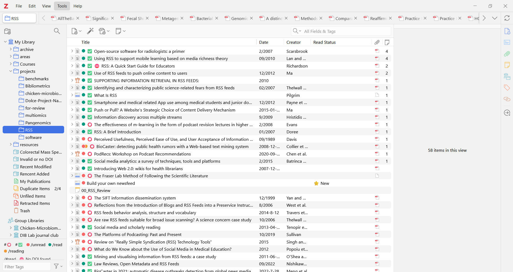{.lightbox}
::::

:::

## [Install plugins to complete Zotero's extenstion]{.small} {data-menu-title="Installing plugins: Step 2"}

### Install & Setup

::: {.columns}

:::: {.column width="45%"}

::::: {.small}

:::::: {.nonincremental}

1.  [Open Zotero]{.op}
2.  Select `Tools` [`r knitr::asis_output("\U1F896")`]{.arrow} `Plugins`

::::::

:::::

::::

:::: {.column width="55%"}

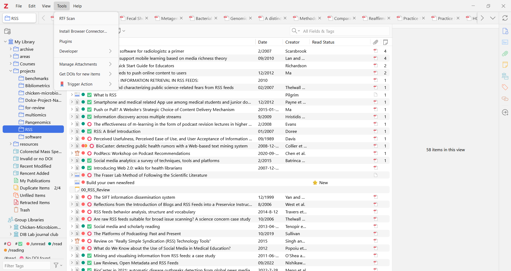{.lightbox}

::::

:::

## [Install plugins to complete Zotero's extenstion]{.small} {data-menu-title="Installing plugins: Step 3"}

### Install & Setup

::: {.columns}

:::: {.column width="45%"}

::::: {.small}

:::::: {.nonincremental}

1.  [Open Zotero]{.op}
2.  [Select `Tools` [`r knitr::asis_output("\U1F896")`]{.arrow} `Plugins`]{.op}
3.  Select the gear (:gear:) in the top-right corner


::::::

:::::

::::

:::: {.column width="55%"}

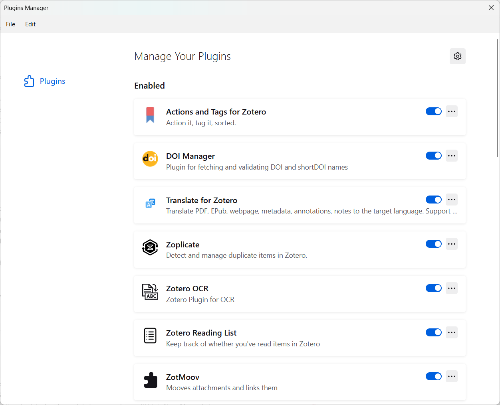{.lightbox}

::::

:::

## [Install plugins to complete Zotero's extenstion]{.small} {data-menu-title="Installing plugins: Step 4"}

### Install & Setup

::: {.columns}

:::: {.column width="45%"}

::::: {.small}

:::::: {.nonincremental}

1.  [Open Zotero]{.op}
2.  [Select `Tools` [`r knitr::asis_output("\U1F896")`]{.arrow} `Plugins`]{.op}
3.  [Select the gear (:gear:) in the top-right corner]{.op}
4.  Choose `Install Plugins From File…`

::::::

:::::

::::

:::: {.column width="55%"}

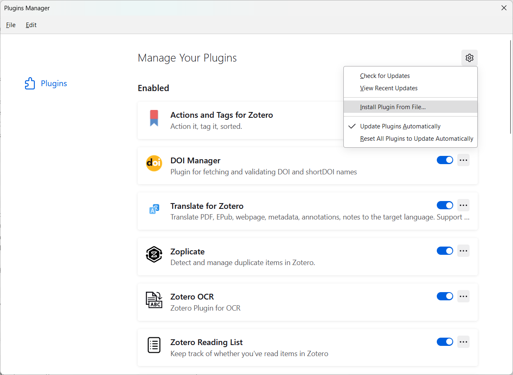{.lightbox}

::::

:::

## [Install plugins to complete Zotero's extenstion]{.small} {data-menu-title="Installing plugins: Step 5-8"}

### Install & Setup

::: {.columns}

:::: {.column width="45%"}

::::: {.small}

:::::: {.nonincremental}

1.  [Open Zotero]{.op}
2.  [Select `Tools` [`r knitr::asis_output("\U1F896")`]{.arrow} `Plugins`]{.op}
3.  [Select the gear (:gear:) in the top-right corner]{.op}
4.  [Choose `Install Plugins From File…`]{.op}
5.  Choose `.xpi` files to install
6.  Select `Open`
7.  Select `Install`
8.  Restart Zotero

::::::

:::::

::::

:::: {.column width="55%"}


::::

:::


## [Configure Zotero for well-organized storage]{.small}

### Install & Setup

::: {.notes}

https://forums.zotero.org/discussion/83262/zotfile-move-web-snapshot-web-snapshot-and-cloud-storage https://github.com/jlegewie/zotfile/issues/566 https://ikashnitsky.phd/2019/zotero/ https://ikos-dighum.github.io/contents/betterbibtex/markdown_zotero.html

:::

::: {.r-stack}

:::: {style="margin: 0;"}

::::: small

1.  Go to `Edit` [`r knitr::asis_output("\U1F896")`]{.arrow} `Settings`
    -   For MacOS, it is `Zotero` [`r knitr::asis_output("\U1F896")`]{.arrow} `Settings` (?)

    [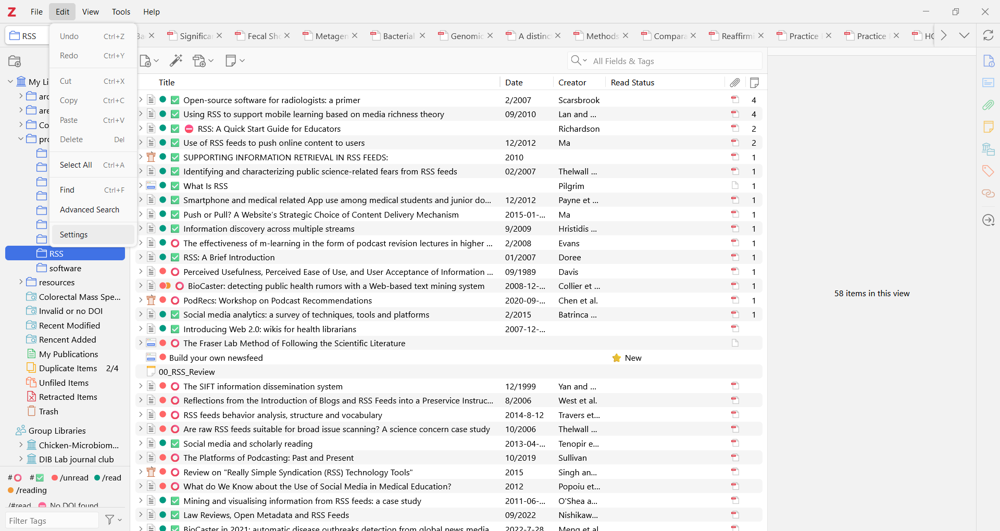{.lightbox}]{.fragment .absolute bottom=0 width=500}

2.  Under `General` [`r knitr::asis_output("\U1F896")`]{.arrow} `File Handling`

[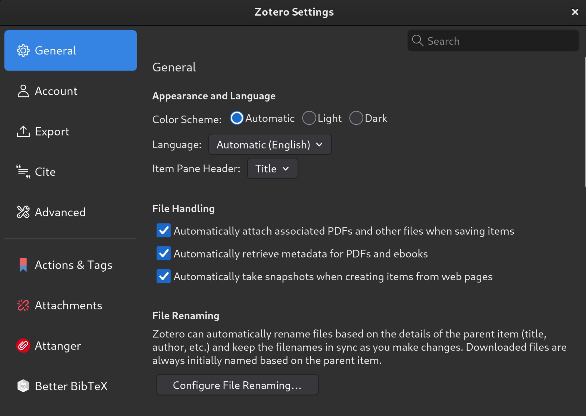{.lightbox}]{.fragment .absolute bottom=0 right=0 width=500}

3. [Under `General` [`r knitr::asis_output("\U1F896")`]{.arrow} `File Renaming`](https://www.zotero.org/support/file_renaming){target="_blank"}

[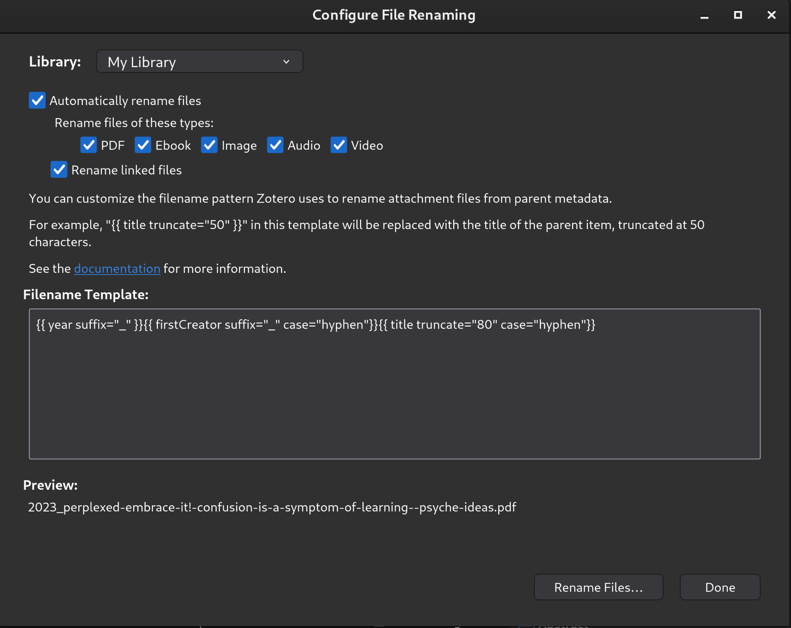{.lightbox}]{.fragment .absolute bottom=0 right=0 width=500}

:::::

::::

:::

## [Backing up your storage to the web]{.small}

### Install & Setup

::: {.columns}

:::: {.column}

1. Under `Account` [`r knitr::asis_output("\U1F896")`]{.arrow} `Account` link your web account
    - Under `Sync`
        - Uncheck `Sync full-text content`
    - Under `File syncing`
        - Check `sync attachment files in my Library using` [`r knitr::asis_output("\U1F896")`]{.arrow} `WebDAV`
        - Uncheck `Sync attachment files in group libraries using Zotero storage`
::::

:::: {.column}

[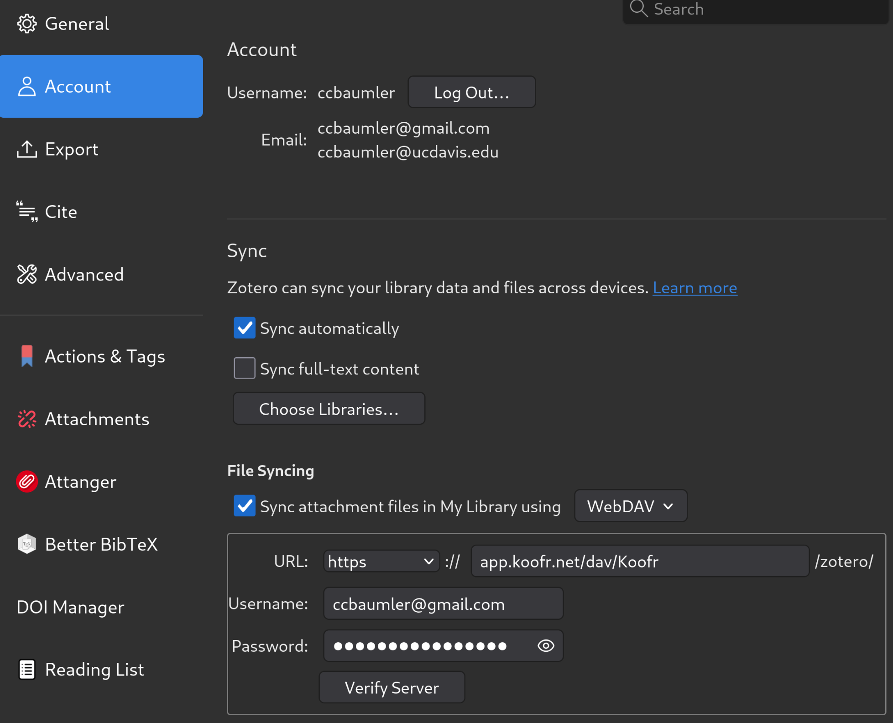{.lightbox}]{.fragment}

::::

:::

## Setting up free storage

### Install & Setup

[Koofr + Zotero = 10 GB free cloud storage](https://koofr.eu/blog/posts/koofr-with-zotero-via-webdav)

::: {style="display: flex; justify-content: center;"}


:::

## [ZotMoov allows automated attachment management!]{.small} {.scrollable}

### Install & Setup

::: {.small}

1. `Directory to Move/Copy Files To` should be ***your library directory***
2. `File Behavior` change to `Copy`
3. [Set up your directory structure:](https://github.com/wileyyugioh/zotmoov/blob/master/docs/WILDCARD_INFO.md#zotmoov-wildcard-formatting){target="_blank"}
    - Nested [`r knitr::asis_output("\U1F896")`]{.arrow}\n`{/%y}{/%F}`<br>for `~/Year/First_Author`<br>(e.g. `~/2014/ZutJ`)
    - Flattened [`r knitr::asis_output("\U1F896")`]{.arrow} `/{%y}_{%a}`<br>for `~/Year_AuthorLastName`<br>(e.g. `~/2014_Zut`)

[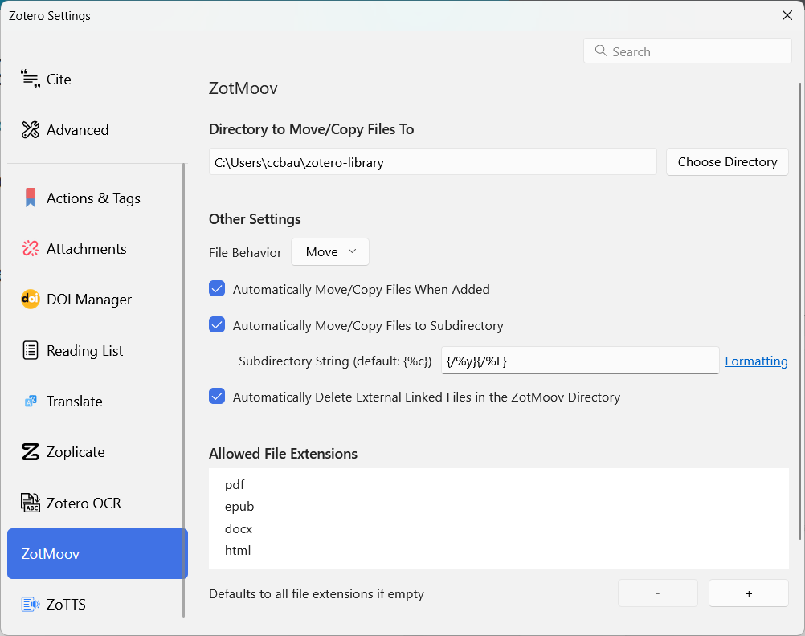{.lightbox}]{.fragment .absolute bottom=0 right=0 width=575}

:::

## Zotero can become a personal web archive

### Install & Setup

1.  Under `General` [`r knitr::asis_output("\U1F896")`]{.arrow} `File Handling`

[[An Example](https://psyche.co/ideas/perplexed-embrace-it-confusion-is-a-symptom-of-learning){target="_blank"}]{.fragment}

[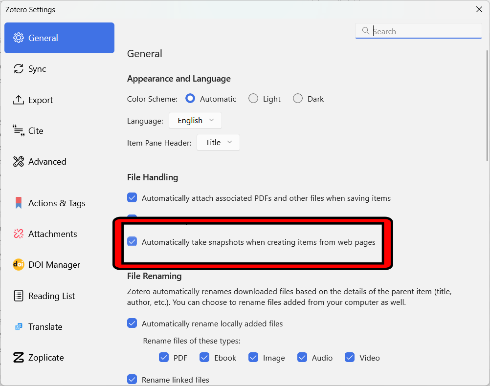{.lightbox}]{.fragment .absolute bottom=0 right=0 width=575}

## Migrating to Zotero is mostly painless

### Install & Setup

Follow the [instructions for any popular tool](https://www.zotero.org/support/moving_to_zotero){target="_blank"}

<br></br>

::: small
> You can also import from other tools, such as Reference Manager, RefWorks, Papers, Google Scholar Library, ReadCube, etc., by exporting to a standardized reference format, such as RIS, BibTeX, or CSL JSON, and then importing into Zotero by clicking File → "Import..." and choose "A file".
:::

# Suggested Usage

::: nonincremental
-   Organizing in multiple ways
-   Efficiently using Zotero
-   AI extensions
:::

## [A simple, standard directory structure is easy to organize]{.small}

### Suggested Usage

::: columns
::: column
-   PARA
    -   Projects
        -   Short-term efforts
    -   Areas
        -   Long-term efforts
    -   Resources
        -   Topics of interest
    -   Archives
        -   Inactive items from the other categories
:::

::: column
::: vscroll
```{dot}
//| echo: false
//| fig-height: 6.5
//| fig-width: 3
digraph PARA { 
  edge [arrowhead=none];
  ranksep=0.5;
  nodesep = 1;
  splines = ortho;
  rankdir = LR;

  node [ shape="folder", width = 1.25, height = 0.75, fixedsize=true, style="filled" gradientangle="270", fillcolor="lightyellow:sandybrown", fontcolor="black"];
  "My Library" [shape="box3d", style="filled" gradientangle="270", fillcolor="sandybrown:peru", fontcolor="black"];
  Projects Areas Resources Archives;

#  node [ shape="note", width = 1, height = 0.5, fixedsize=true, style="filled", fillcolor="white", fontcolor="black"];
#item item2 paper;

  node [ shape="point", width = 0, height = 0];
  { rank = same; W0 W1 W2 W3}

  W0 -> "My Library" [constraint=false];
  W0 -> W1 -> W2 -> W3;        /* critical! */
  
  W0 -> Projects;

  W1 -> Areas;

  W2 -> Resources;

  W3 -> Archives;

    node [ shape="point", width = 0, height = 0 ];
  { rank = same; W0 W3 W2 W1 }
  
}
```
:::
:::
:::

## [A simple, standard directory structure is easy to organize]{.small}

### Suggested Usage

::: columns
::: {.column .nonincremental}
-   PARA
    -   Projects
        -   Short-term efforts
    -   Areas
        -   Long-term efforts
    -   Resources
        -   Topics of interest
    -   Archives
        -   Inactive items from the other categories
:::

::: column
::: vscroll
```{dot}
//| echo: false
//| fig-height: 16.5
//| fig-width: 4.5
digraph PARA { 
  edge [arrowhead=none];
  ranksep=0.5;
  nodesep = 1;
  splines = ortho;
  rankdir = LR;

  node [ shape="folder", width = 1.25, height = 0.75, fixedsize=true, style="filled" gradientangle="270", fillcolor="lightyellow:sandybrown", fontcolor="black"];
  "My Library" [shape="box3d", style="filled" gradientangle="270", fillcolor="sandybrown:peru", fontcolor="black"];
  Projects Areas Resources Archives QE Dissertation "Review\nPaper" Writing "Teaching" "Broader\nImpacts" "Dry\nLab" "Wet\nLab" Learning "Completed\nProjects" "Inactive\nAreas" "Irrelevant\nResources";

#  node [ shape="note", width = 1, height = 0.5, fixedsize=true, style="filled", fillcolor="white", fontcolor="black"];
#item item2 paper;

  node [ shape="point", width = 0, height = 0];
  { rank = same; W0 W1 W2 W3}

  node [ shape="point", width = 0, height = 0];
  { rank = same; P0 P1 P2 P3 P4 P5 P6 P7 P8 P9 P10 P11};

  W0 -> "My Library" [constraint=false];
  W0 -> W1 -> W2 -> W3;        /* critical! */
  
  W0 -> Projects;
  Projects -> P2;
  P0 -> P1 -> P2;
  P0 -> "QE";
  P1 -> "Dissertation";
  P2 -> "Review\nPaper";
  
  W1 -> Areas;
  Areas -> P4;
  P3 -> P4 -> P5;
  P3 -> "Writing";
  P4 -> "Teaching";
  P5 -> "Broader\nImpacts";
  
  W2 -> Resources;
  Resources -> P7;
  P6 -> P7 -> P8;
  P6 -> "Dry\nLab";
  P7 -> "Wet\nLab";
  P8 -> "Learning";
  
  W3 -> Archives;
  Archives -> P9;
  P9 -> P10 -> P11;
  P9 -> "Completed\nProjects";
  P10 -> "Inactive\nAreas";
  P11 -> "Irrelevant\nResources"
  
    node [ shape="point", width = 0, height = 0 ];
  { rank = same; W4 W5 W6 W0 W3 W2 W1 }
  
}
```
:::
:::
:::

## [Many avenues are available for finding you documents]{.small}

### Suggested Usage

To gather attachments:

::: columns
::: {.column width="60%"}
-   Base Zotero
    -   unpaywall
    -   retraction watch
-   Zotero Connector
    -   [Database query](https://scholar.google.com/scholar?hl=en&as_sdt=0%2C5&q=zone+of+proximal+development&btnG=&oq=zone+of+) [`r knitr::asis_output("\U1F896")`]{.arrow} Click :file_folder:
    -   [Load article](https://www.nature.com/articles/s41597-024-03571-y) or webpage [`r knitr::asis_output("\U1F896")`]{.arrow} Left or Right click item icon
:::

::: {.column width="40%"}
-   Bypass paywalls
    -   [archive.today](https://archive.ph/){target="_blank"}
    -   [Medium articles](https://freedium.cfd/){target="_blank"}
    -   [Scholar subreddit](https://www.reddit.com/r/Scholar/)
:::
:::

## Including headers can increase note organization

### Suggested Usage

::: columns
::: column
Including the `Notes` column for quick reference:

-   Right-click column headers in any collection
-   Check `Notes`
:::

::: column
Quick example of note taking and importing into text editor:

-   Open pdf in Zotero
-   Create annotations (`Alt+1` & `Alt+3`)
-   Right-click item and `Add Note from Annotations`
-   Open text editor
-   Import note
:::
:::

## [Tags are incredible for organizing with visual aids!]{.small}

### Suggested Usage

Use tags to mark all read and unread items:

1.  Add :o: to an item in the `Tags` panel.
2.  In the lower left panel, right click the tag [`r knitr::asis_output("\U1F896")`]{.arrow} `Assign Color...`
3.  Select a color and `Set color`
4.  Select all items and drop into the tag

For automatic tagging, install the [Actions and Tags](https://github.com/windingwind/zotero-actions-tags){target="_blank"} addon

## [For increased resolution create a ***Folksonomy***, a thesaurus of tags]{style="font-size: 0.70em;"}

### Suggested Usage

::: columns
::: column
Why?

-   Individuals or groups will quickly find and re-find sources
-   Metadata is shared in groups
    -   Offers guidance to beginners
:::

::: column
How?

-   Think and create some keywords that capture the text contents
-   Skim abstracts and papers for keywords
-   Use bibliometrics or LLMs:
    -   [`Create a folksonomy, or a thesaurus of tags, for [topics] studies.`]{.small}
:::
:::

## [Auto-Curate your library through saved searches]{.small}

### Suggested Usage

::: notes
A final organizational tool within Zotero is the saved searched. By creating curated searches new items will auto populate by well-defined rules set by the user. These saved searches allow a user to find the new items in both their Unfiled collection and their saved searches. All to allow the user more focused options when beginning their reading or writing tasks.
:::

-   Start an advanced search:
    -   Click the :mag:
    -   Click `Edit` [`r knitr::asis_output("\U1F896")`]{.arrow} `Advanced Search`
    -   `Ctrl+Shift+F`
-   Define an area of continued interest
-   Using keywords in `All fields`, rapidly tag groups of items

## Citing and bibliographies are simplified

### Suggested Usage

::: notes
Paste the citations: `Ctrl+Shift+C` a Zotero item/s you have selected [`r knitr::asis_output("\U1F896")`]{.arrow} `Ctrl+v` in text editor
:::

::: small
-   Google Docs for collabratory documents
    -   Open google doc: Open a google doc in the google drive you would like to sync to your Zotero library.
    -   Link account: Integrate your google account with Zotero by clicking `Z` in the toolbar.
        -   Authenticate the Google account used to edit the document
-   Microsoft Word for local documents
    -   Open Word Doc: Open a word document...
    -   Done?: There is now a Zotero tab in you document linked to your library!
-   Libre Office for local documents
    -   Open Libre Writer: Open a writer document...
    -   Done?: There is now a Zotero toolbar in you document linked to your library!
:::

## [Extend your capabilities with addons and external tools]{.small}

### Suggested Usage

::: {.nonincremental .smaller}
Additional addons:

-   [References](https://github.com/MuiseDestiny/zotero-reference){target="_blank"}
-   [Scite](https://github.com/scitedotai/scite-zotero-plugin){target="_blank"}
-   [DOI Manager](https://github.com/bwiernik/zotero-shortdoi){target="_blank"}
-   [Better Notes](https://github.com/windingwind/zotero-better-notes#readme){target="_blank"}
-   [Translate](https://github.com/windingwind/zotero-pdf-translate#readme){target="_blank"}
-   [An AI Assistant?](https://github.com/lifan0127/ai-research-assistant?tab=readme-ov-file#aria-aria---your-ai-research-assistant){target="_blank"}

Integrated external tools:

-   [Research Rabbit](https://www.researchrabbit.ai/){target="_blank"}

External tools:

-   [semantic scholar](https://www.semanticscholar.org/me/research)
-   [connected papers](https://www.connectedpapers.com/)
-   [elicit](https://elicit.com/)
-   [QED](https://www.qedscience.com/)
-   [Consensus](https://consensus.app/)
-   [ChatGPT](https://chatgpt.com/)
:::

# Break!

```{r}
#| echo: false
countdown::countdown(minutes = 5, seconds = 0, warn_when = 120, 
                     right = "0%", top = "10%",
                     blink_colon = TRUE, id = "special_timer")
```

# Analyzing Literature


## [Bibliometrics provides an accessible framework for equitable scholarship]{.smaller}

### Background

["\[Bibliometrics is\] The measurement of all aspects related to the publication and reading of books and documents."](https://www.nature.com/articles/510218e){target="_blank"}

::: columns
::: {.column width="50%"}
-   [Bibliometrics uses]{.fragment}

    -   Archival database
    -   Article metadata
    -   Statistical analysis
:::

::: {.column width="50%"}
-   [Bibliometrics answers]{.fragment}

    -   where the field has grown from
    -   its most relevant articles
    -   its emerging topics
:::
:::

## [Bibliometrics yields networks based on references]{.small}

### Background

[Bibliometrics can rapidly build your compentence in a domain]{.fragment}

[Bibliometrics can expose you to the techniques of a domain]{.fragment}



## [Minimize your time confused with bibliometrics]{style="font-size:0.80em;"}

### Background

-   General bibliometric science yields:
    -   A solid foundation of the necessary concepts
    -   The questions answered by the field
    -   Some open areas of discovery within the field
-   My proposed use of a bibliometric framework
    -   Use **reproducible** methods
    -   for **systematic** evaluation
    -   in a **quantifiable** way!
    -   Ultimately, ending with justifiable literature for your needs

# Databases

::: nonincremental
-   Basics of literature search
    -   Which databases to use
    -   Searching techniques
    -   Sample size
    -   Exporting search metadata
    -   Filtration techniques
:::

## [Your database choice ***will*** affect your results]{style="font-size:0.80em"}

### Databases

::: notes
[Each database has its benefits and drawbacks](https://direct.mit.edu/qss/article/2/1/20/97574/Large-scale-comparison-of-bibliographic-data), but scopus and web of science are the competing standard. They also have the best metadata curation for our analysis

https://paperpile.com/g/academic-research-databases/
:::

Databases focus on different levels of content selection, curation, and comprehensiveness.

::: nonincremental
::: columns
::: {.column width="50%"}
-   Web of Science (WoS)
-   Scopus
-   PubMed
-   Dimensions
-   CrossRef
:::

::: {.column width="50%"}
::: {data-id="text"}
-   Semantic Scholar
-   Microsoft Academic
-   Lens.org
-   Cochran Library
-   Google Scholar
:::
:::
:::
:::

[["Scopus and WoS compliment each others as neither resource is all inclusive"](https://www.ncbi.nlm.nih.gov/pmc/articles/PMC1420322/){target="_blank"}]{.smaller}

## [Your database choice ***will*** affect your results]{style="font-size:0.80em"}

### Databases

::: notes
[Each database has its benefits and drawbacks](https://direct.mit.edu/qss/article/2/1/20/97574/Large-scale-comparison-of-bibliographic-data){target="_blank"}, but scopus and web of science are the competing standard. They also have the best metadata curation for our analysis

https://paperpile.com/g/academic-research-databases/
:::

Databases focus on different levels of content selection, curation, and comprehensiveness.

::: nonincremental
::: columns
::: {.column width="50%"}
-   **Web of Science (WoS)**
-   **Scopus**
-   **PubMed**
-   [Dimensions]{.op style="font-size: 0.75em"}
-   [CrossRef]{.op style="font-size: 0.75em"}
:::

::: {.column width="50%"}
::: {.op style="font-size: 0.75em"}
-   Semantic Scholar
-   Microsoft Academic
-   Lens.org
-   Cochran Library
-   Google Scholar
:::
:::
:::
:::

[["Scopus and WOS compliment each others as neither resource is all inclusive"](https://www.ncbi.nlm.nih.gov/pmc/articles/PMC1420322/){target="_blank"}]{.smaller}

## [Signing up, search and exporting can be nuianced]{.small}

### Databases 

- Register with university email for Scopus and WoS access when off university wifi/[library VPN](https://library.ucdavis.edu/vpn/)
    - PubMed does not require registration at all

::: {.columns}
:::: {.column width="33%"}

-
  - [Scopus](https://www.scopus.com/search/form.uri?display=basic#basic){target="_blank"} [(Multidisciplinary)]{.smaller}
    - 82.4 million records
    - 1788 – present
    - bibtex 
    - full record 
    - 20,000 export limit

::::

:::: {.column width="33%"}
- 
  - [WoS](https://www.webofscience.com/wos/woscc/basic-search){target="_blank"} [(Multidisciplinary)]{.smaller}
    - Core, 79 million
    - 1900 - present
    - plaintext or bibtex 
    - custom selection
    - 1000 export limit

::::

:::: {.column width="33%"}
- 
  - [PubMed](https://pubmed.ncbi.nlm.nih.gov/){target="_blank"} [(Only life science and biomedical)]{.smaller}
    - 35 million
    - 1966 - present (*1809)
    - plaintext
    - pubmed format
    - 10,000 export limit

::::
:::

## Vocabulary is vital for a good search! {.smaller}

### Databases

controlled vocabulary thesaurus

-   [**Me**dical **S**ubject **H**eadings (MeSH) Tree](https://meshb.nlm.nih.gov/){target="_blank"}
-   Search "controlled vocabulary thesaurus for \[biology\]"

::: {.fragment}
Try [ChatGPT](https://chat.openai.com/){target="_blank"}?

> What are keywords for \[microbial metagenomic metabolomic metabolite cancer research\]?

> Create a controlled vocabulary for \[microbial metagenomic metabolomic metabolite cancer research\].

:::

## [Wildcards allow the capture of many individual words]{style="font-size:0.80em;"}

### Databases

::: {style="font-size: 0.75em"}
| Wildcard Charater | Definition                                | Example | Result                                           |
|:-----------------:|:-----------------|:-----------------:|:-----------------|
|        \*         | Any amount of character/s to include zero | `*man`  | `man, woman, human, superman, superwoman, {etc}` |
|         ?         | Any single character                      | `wom?n` | `woman, women`                                   |
|   \$ (WoS only)   | Any single or no character                | `$$man` | `woman, man, human`                              |

: Wildcards {#tbl-wd}
:::

## [Boolean operators are vital to focus a corpus]{style="font-size:0.80em;"}

### Databases

::: vscroll
::: {style="font-size: 0.75em"}
|     Operator      | Affect on Search | Definition                                                                           | Example                               |
|:------------------:|:-----------------|:-----------------|:-----------------|
|      **AND**      | Narrows          | Intersects *all* terms separated by operator                                               | `migration AND butterfl*`            |
|      **OR**       | Broadens         | Unites *any* and *all* terms separated by operator                                     | `migration OR butterfl*`             |
|      **NOT**      | Narrows          | Excludes term following operator                                                     | `migration AND bird* NOT butterfl*` |
|  **NEAR/x**(WoS)  | Narrows          | Find terms joined by operator *near* each other by $x$ words                         | `America NEAR/10 butterfly`           |
|   **SAME**(WoS)   | Narrows          | Find terms joined by operator if in the *same* sentence                              | `America SAME butterfly`              |
|  **W/n**(Scopus)  | Narrows          | Find terms joined by operator *within* each other by $n$ words                       | `American W/10 butterfly`             |
| **Pre/n**(Scopus) | Narrows          | Find terms where *preceeding* term to operator is within $n$ words of following term | `American Pre/3 butterfly`            |

: Boolean Operators {#tbl-bo}
:::
:::

## Searching by phrase may simplify a search

### Databases

::: {style="font-size: 0.75em"}
|    Phrase type    |       Example        |                       Search                       |
|:----------------------:|:----------------------:|:----------------------:|
|     **Loose**     | `"phrase searching"` | `phrase search, phrase searches, phrase searching` |
| **Exact**(Scopus) | `{phrase searching}` |                 `phrase searching`                 |

: Pharse Searching {#tbl-ps}
:::

::: notes
lemmatization and stemming (i.e. techniques to reduce words to their root form)

loose allows for wildcards to be included in the quotations. exact will search for the exact characters inbetween the curly braces (do not include wildcards)
:::

## [Combine all search techniques for the best corpus results]{.small} {auto-animate="true"}

### Databases

WoS = 184

::: {.smaller data-id="wos"}
> ALL=(("colorectal cancer\*" OR "colorectal neoplas\*" OR "adenomatous polyposis coli" OR "colon\* neoplas\*" OR "rectal neoplas\*" OR "hereditary nonpolypo\*") AND ("metagenom\*" AND "metabol\*"))
:::

Scopus = 367 & PubMed = 248

::: {.smaller data-id="scopus"}
> TITLE-ABS-KEY ( "colorectal cancer\*" OR "colorectal neoplas\*" OR "adenomatous polyposis coli" OR "colon\* neoplas\*" OR "rectal neoplas\*" OR "hereditary nonpolypo\*" AND "metagenom\*" AND "metabol\*" )
:::

## [Combine all search techniques for the best corpus results]{.small} {auto-animate="true"}

### Databases

WoS = 184

::: {.small data-id="wos"}
> ALL=([**(**]{style="color: red;"}"colorectal cancer\*" OR "colorectal neoplas\*" OR "adenomatous polyposis coli" OR "colon\* neoplas\*" OR "rectal neoplas\*" OR "hereditary nonpolypo\*"[**) AND (**]{style="color: red;"}metagenom\*" AND "metabol\*"[**)**]{style="color: red;"})
:::

Scopus = 367 & PubMed = 248

::: {.smaller data-id="scopus"}
> TITLE-ABS-KEY ( "colorectal cancer\*" OR "colorectal neoplas\*" OR "adenomatous polyposis coli" OR "colon\* neoplas\*" OR "rectal neoplas\*" OR "hereditary nonpolypo\*" AND "metagenom\*" AND "metabol\*" )
:::

## [Sample Size goals of 500 - 1500 articles]{.small}

### Databases

```{=html}
<style>
.container {
  position: relative;
  width: 100%;
}

.image {
  opacity: 1;
  display: block;
  width: 100%;
  height: auto;
  transition: .5s ease;
  backface-visibility: hidden;
}

.middle {
  transition: .5s ease;
  opacity: 0;
  position: absolute;
  top: 50%;
  left: 50%;
  transform: translate(-50%, -50%);
  -ms-transform: translate(-50%, -50%);
  text-align: center;
}

.container:hover .image {
  opacity: 0.3;
}

.container:hover .middle {
  opacity: 1;
}

.text {
  background-color: #04AA6D;
  color: white;
  font-size: 16px;
  padding: 16px 32px;
}
</style>

<div class="container">
  
  <div class="middle">
    Results from power simulation, showing power as a function of sample size, with effect sizes shown as different colors, and alpha shown as line type. The standard criterion of 80 percent power is shown by the dotted black line.
  </div>
</div>
```

## Build a corpus for your interests

### Databases

Focus on [WoS](https://www.webofscience.com){target="_blank"} and/or [Scopus](https://www.scopus.com){target="_blank"}

::: {.notes}
Keep in mind, from this point on a literature search should only ever take a maximum of 10-15 minutes.

Refer back to @tbl-wd, @tbl-bo, @tbl-ps
:::

```{r Timer corpus}
#| echo: false
countdown::countdown(minutes = 10, seconds = 0, warn_when = 120, 
                     right = "0%", top = "0%",
                     blink_colon = TRUE, id = "special_timer")
```

::: vscroll
::: {#tbl-panel layout-ncol="1"}
::: {style="font-size: 0.75em"}
<hr/>

| Wildcard Charater | Definition                                | Example | Result                                           |
|:-----------------:|:-----------------|:-----------------:|:-----------------|
|        \*         | Any amount of character/s to include zero | `*man`  | `man, woman, human, superman, superwoman, {etc}` |
|         ?         | Any single character                      | `wom?n` | `woman, women`                                   |
|   \$ (WoS only)   | Any single or no character                | `$$man` | `woman, man, human`                              |

: Wildcards
:::

::: {style="font-size: 0.75em"}
<hr/>

|     Operator      | Affect on Search | Definition                                                                           | Example                               |
|:------------------:|:-----------------|:-----------------|:-----------------|
|      **AND**      | Narrows          | Find *all* terms separated by operator                                               | `migration AND butterfl\*`            |
|      **OR**       | Broadens         | Find *any* and *all* terms separated by operator                                     | `migration OR butterfl\*`             |
|      **NOT**      | Narrows          | Excludes term following operator                                                     | `migration AND bird\* NOT butterfl\*` |
|  **NEAR/x**(WoS)  | Narrows          | Find terms joined by operator *near* each other by $x$ words                         | `America NEAR/10 butterfly`           |
|   **SAME**(WoS)   | Narrows          | Find terms joined by operator if in the *same* sentence                              | `America SAME butterfly`              |
|  **W/n**(Scopus)  | Narrows          | Find terms joined by operator *within* each other by $n$ words                       | `American W/10 butterfly`             |
| **Pre/n**(Scopus) | Narrows          | Find terms where *preceeding* term to operator is within $n$ words of following term | `American Pre/3 butterfly`            |

: Boolean Operators
:::

::: {style="font-size: 0.75em"}
<hr/>

|    Phrase type    |       Example        |                       Search                       |
|:----------------------:|:----------------------:|:----------------------:|
|     **Loose**     | `"phrase searching"` | `phrase search, phrase searches, phrase searching` |
| **Exact**(Scopus) | `{phrase searching}` |                 `phrase searching`                 |

: Phrase Searching
:::

Wildcards, Boolean Operators, Phrase Searching
:::
:::

## [Filtration techniques are whatever work for you]{.small}{data-menu-title="Filtration techniques: Prisma"}

### Databases

::: {.notes}
Prisma https://www.sciencedirect.com/science/article/pii/S0895435609001802?via%3Dihub

80-20 method while scrolling through database? refer to a better way - metagear here?
:::

::: {.columns}
:::: {.column width="65%"}
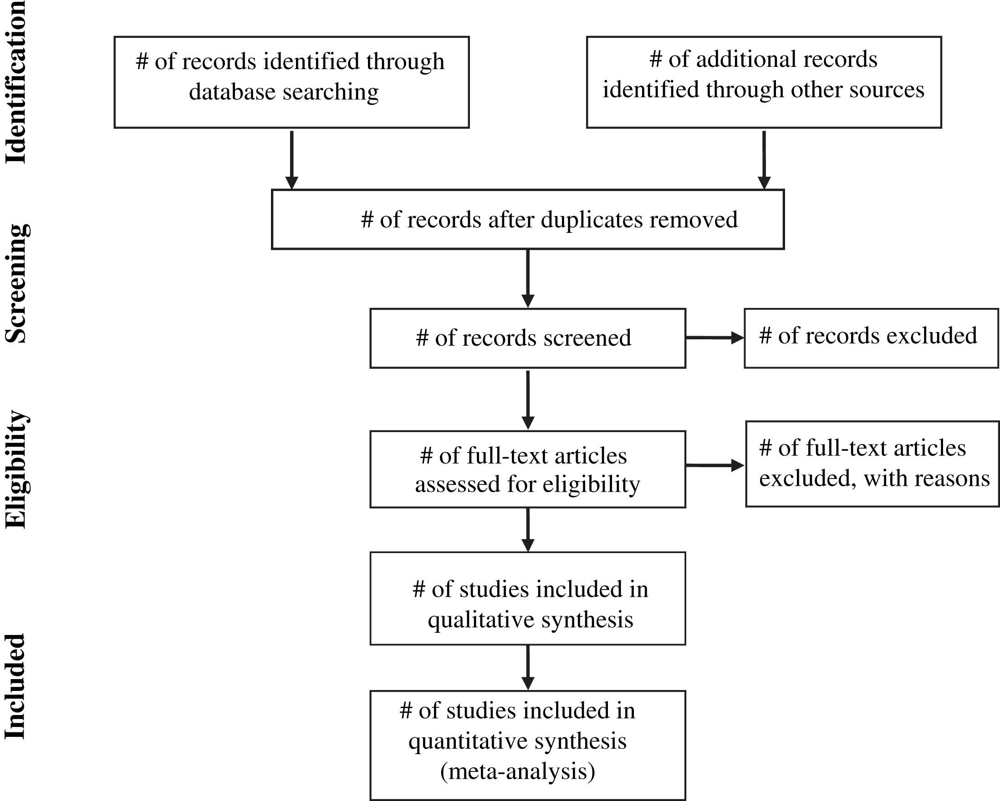
::::

:::: {.column width="35%"}
Literature filtration

::::: nonincremental
- Prisma
:::::
::::
:::

## [Filtration techniques are whatever work for you]{.small}{data-menu-title="Filtration techniques:80:20"}

### Databases

::: {.notes}
Prisma https://www.sciencedirect.com/science/article/pii/S0895435609001802?via%3Dihub

80-20 method while scrolling through database? refer to a better way - metagear here?
:::

::: {.columns}
:::: {.column width="65%"}
{width=75%}
::::

:::: {.column width="35%"}
Literature filtration

::::: nonincremental
- [Prisma]{.op}
- 80:20
:::::
::::
:::

## [Filtration techniques are whatever work for you]{.small}{data-menu-title="Filtration technique: `metagear`"}

### Databases

::: {.notes}
Prisma https://www.sciencedirect.com/science/article/pii/S0895435609001802?via%3Dihub

80-20 method while scrolling through database? refer to a better way - metagear here?
:::

::: {.columns}
:::: {.column width="65%"}
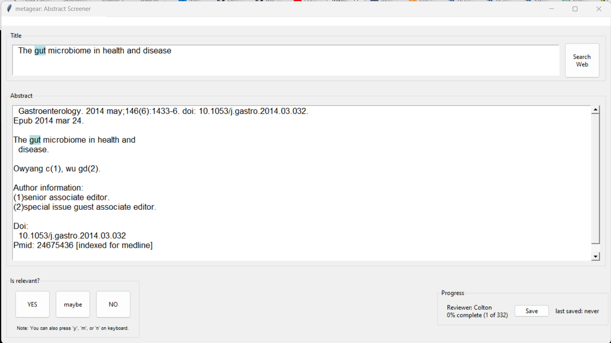
::::

:::: {.column width="35%"}
Literature filtration

::::: nonincremental
- [Prisma]{.op}
- [80:20]{.op}
- `metagear`?
:::::
::::
:::

# Techniques for Success

::: {.nonincremental}

- Quickly sort articles from feeds
- Time management and blocking
- Achievable Goals
- Boredom

:::

## The 80:20 method is ideal to filter papers

### Techniques for Success

::: columns
::: {.column width="40%"}
- 80:20? 
  - Remove 20% each step
  
- Remember IMRaD?
  - RSS reader focus on Title and Abstract! `f`
  - Import `f` into reference manager
  - "**[I]{.underline}**'**[D]{.underline}** **[M]{.underline}**embe**[R]{.underline}**" better
:::

::: {.column width="60%" .absolute top=90 right=0}

[]{.absolute top="100" right="0" width="500"}

```{mermaid}
%%| echo: false
%%| eval: false

%%{
  init: {
    "theme": "vapor",
    'themeVariables': {
      'lineColor': '#00ebb4'
    }
  }
}%%

flowchart TD;
    A[Read the title] ==>|Interesting?| B[Skim the abstract];
    A ==Not interesting?==> C[Discard or Cite];
    B ==Still interesting?==> D[Skim the headers and figures];
    B ==Second thoughts?==> C;
    D ==A worthwhile read?==> E[Read the Intro and Discussion!];
    D ==Reconsidering?==> C;
    E ==Something novel?==> F[Study the Methods and Results];
    E ==Meh?==> C;
    F ==Good stuff cited?==> G[Dig into the references]

    linkStyle default color:red;
```

:::

:::

::: notes
https://github.com/quarto-dev/quarto-cli/issues/2165

https://stackoverflow.com/questions/63082398/change-font-of-text-on-links-in-graph-mermaid
:::

## [Mindfully approach time management for best results!]{style="font-size:0.80em;"}

### Techniques for Success

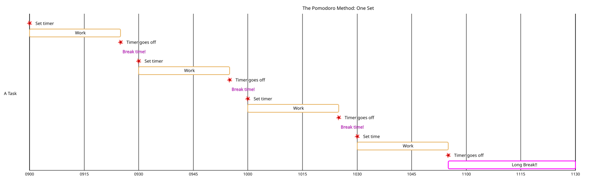{.lightbox width=120%}

- Consider time blocking
  - When do you work best?
  - 3-2-1 method
  


```{mermaid}
%%| echo: false
%%| eval: false

%%{init: {
  "theme": "base",
  "themeVariables": {
    "primaryColor": "#ffb11f",
    "primaryTextColor": "#eb00c0",
    "primaryBorderColor": "#005F87",
    "secondaryColor": "#FFD700",
    "secondaryTextColor": "#000000",
    "tertiaryColor": "#ffa58a",
    "tertiaryTextColor": "#1fa5ff",
    "taskTextLightColor": "#eb00c0",
    "taskTextDarkColor": "#ff1"
  },
"themeCSS": ".titleText { font-size:24px; font-weight:bold; }, .sectionTitle:not([font-size]), .sectionTitle[font-size] { font-size:20px; font-weight:bold; }, .taskText:not([font-size]), .taskText[font-size] { font-size:15px; font-weight:bold; }, .taskTextOutsideRight:not([font-size]), .taskTextOutsideRight[font-size] { font-size:16px; font-weight:bold; }"
}}%%

gantt 
    title The Pomodoro Method: One Set
    dateFormat hh:mm
    axisFormat %H%M
    
    section A Task
    Set timer : done, milestone, 09:00, 0min
    Work : 09:00, 09:25
    Timer goes off: done, milestone, 09:25, 0min
    Break time! : 5min
    Set timer : done, milestone, 09:30, 0min
    Work : 09:30, 09:55
    Timer goes off: done, milestone, 09:55, 0min
    Break time! : 5min
    Set timer : done, milestone, 10:00, 0min
    Work : 10:00, 10:25
    Timer goes off: done, milestone, 10:25, 0min
    Break time! : 5min
    Set time : done, milestone, 10:30, 0min
    Work : 10:30, 10:55
    Timer goes off: done, milestone, 10:55, 0min
    Long Break!! : 10:55, 11:30
```

## Achievable goals lead to accomplishments

### Techniques for Success

::: {.columns}

:::: {.column width="35%"}

```{mermaid}
%%| echo: false

%%{init: {
  "theme": "base",
    'themeVariables': {
      'lineColor': 'blue'
    }
}}%%

flowchart TD;
    A[End of the day] ==> B[List 3-6 tasks for tomorrow];
    B ==> C[Order list by priority];
    C ==> D["Pick up at the first item
    the following day"];
    D ==> E[Finish item on list?] ==> G[Move down list!];
    D ==> F[Need a change?] ==> G;

```

::::

:::: {.column width='65%'}

#### Achievable goals?

- Atomized tasks
  - Focus a task until it is a single operation
  - Doesn't feel comfortable? The task is still too large

- Monotropism
  - Be intentional with you tasks
  - Reach a flow state in knowledge work

::::

:::

## Boredom can lead to creative progress

### Technqiues for Success

#### ~~Ennui/Tedium~~ [Slow thought, Processing ideas]{.fragment}

- Eliminate distractions
  - Boredom or writing
  - Sit in the arboretum
- Set regular scheduled limits
  - 400 words before editing
  - 3-6 hours before task switching


# Summary {.smaller}

You have learned:

::: {.nonincremental .vscroll}
- RSS and Readers
  - The fundamentals of RSS
  - The application to use
- Inoreader
  - Install Inoreader
  - Find academic journal feeds
  - Organize feeds
  - The functionality of Inoreader
- Skills to rapidly consume literature
  - Quickly sort articles from feeds
  - Time management and blocking

- Reference management software
  - s

- Bibliometric Databases
  - Bibliographic databases
  - Search engine techniques
  - Sampling size
  - Exportation and Filtration

:::


## Acknowledgments

### "I have always imagined that Paradise will be a kind of library."<br>Jorge Luis Borges

::: {.columns}

:::: {.column}

::::: {.nonincremental}

-   C. Titus Brown
-   Pamela Reynolds
-   Bryshal Moore
-   Luiz Irber
-   The DataLab
-   Professors For The Future
-   NSF GRFP
-   [IMSD]{.hovertext data-hover="For extended training and mentorship. Grant code is T32 GM135741 (NIH T32 IMSD Program)"}

:::::

::::

:::: {.column}


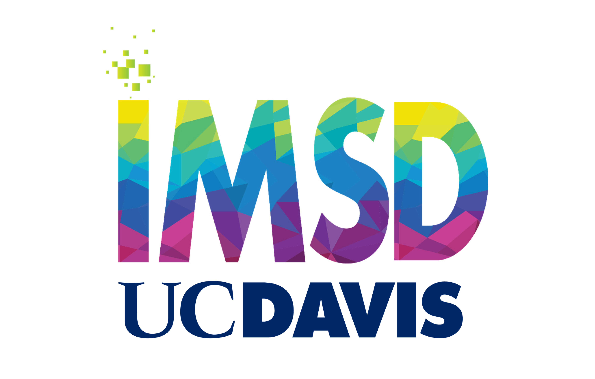

::::

:::


### "The next best thing to being wise oneself is to live in a circle of those who are." :bust_in_silhouette: C.S. Lewis

::: {.columns}

:::: {.column}

::::: {.nonincremental}

-   C. Titus Brown
-   Pamela Reynolds
-   Bryshal Moore
-   Luiz Irber
-   The DataLab
-   Professors For The Future
-   NSF GRFP
-   [IMSD]{.hovertext data-hover="For extended training and mentorship. Grant code is T32 GM135741 (NIH T32 IMSD Program)"}

:::::

::::

:::: {.column}


::::

:::

# Supplementary

## [Sync attachments across computers with google drive]{.small} {.scrollable}

### Install & Setup - Supp.

1.  Download and install [Drive for Desktop](https://www.google.com/drive/download/){target="_blank"}
2.  Skip everything
3.  Go to your `zotero-library` directory
4.  Right-click [`r knitr::asis_output("\U1F896")`]{.arrow} `Sync or Backup this folder`
5.  Only check `Sync with Google Drive`
    -   Should now be synced under `Computers` in google drive
6.  In secondary computer,
    i.  Download, install, and sync [Drive for Desktop](https://www.google.com/drive/download/){target="_blank"}
    ii. Allow `Offline access` to `zotero-library` for local storage
    iii. Repeat the Install & Setup section of this presentation to create the same Zotero system on this new computer - BUT! Replace the `zotero-library` path with the Google Drive `zotero-library` path (Slide: Zotfile is for automated attachment management, Step 2)

## Fixing file locations quickly

### Install & Setup - Supp.

::: notes
zotfile preferences for html

Zotero can also function as a personal web archive. Storing the html files for the websites that are useful for reviewing.

https://github.com/jlegewie/zotfile/issues/566

However, websnap shots have an issue pending in the github repository. They do not automatically rename and move

Simple manual fix until this issue is fixed in an update is to
:::

If your attachments are not all being moved by ZotMoov:

1.  Go to `My Library`
2.  Organize by `Attachments` :paperclip:
3.  Click on the webpage icon to the left of the title
4.  Select all items (`Ctrl+A`)
5.  Right click [`r knitr::asis_output("\U1F896")`]{.arrow} `Manage attachments` [`r knitr::asis_output("\U1F896")`]{.arrow} `Rename and Move`

## [Better BibTeX supports markdown bibliographies]{.small}

### Install & Setup - Supp.

[Better BibTeX Documentation](https://retorque.re/zotero-better-bibtex/citing/index.html)

1.  Select `Edit` [`r knitr::asis_output("\U1F896")`]{.arrow} `Preferences`
2.  Under `Better BibTeX` [`r knitr::asis_output("\U1F896")`]{.arrow} `Open Better BibTeX preferences...`
3.  Set `Citation key formula`
    -   I suggest `auth.lower + year + shorttitle(3,3) + journal.lower.abbr`
4.  When citing, add `@` before the citation key per item cited.


## Finding the RSS link to a website {#Finding_RSS_Links}

### [Click Here to Go Back to Gathering Feeds](#Gather_Feeds)

-   [RSS Validator](https://www.rssboard.org/rss-validator){target="_blank"}
-   Navigate to the website:
    -   Right click page
    -   Select `Page Source`
    -   Press `ctrl+f` or `cmd+f`
    -   Type `rss`
-   [No RSS found?](https://openrss.org/){target="_blank"}

```{css, echo=FALSE}
.interactive-textbox {
  margin: 20px;
}

input[type="text"] {
  padding: 10px;
  font-size: 16px;
  border: 1px solid #ccc;
  border-radius: 5px;
}

#outputText {
  margin-top: 10px;
  font-size: 28px;
  font-weight: bold;
}

#outputText2 {
  margin-top: 10px;
  font-size: 28px;
  font-weight: bold;
}

#outputText3 {
  margin-top: 10px;
  font-size: 28px;
  font-weight: bold;
}
```
